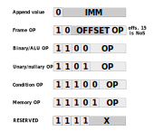

# saladcore C simulator

## Instruction encoding

### Literals
Each LIT instruction holds an unsigned 7-bit immediate value to be concatenated to ToS. The first LIT sets the *LIT_DIRTY* flag, and subsequent ones cause ToS to be left-shifted by 7 before the new value is set. \
Only unsigned values can be formed by concatenation, no sign-extension is done. For negative numbers, NEG instruction can be used.
The *LIT_DIRTY* flag is part of the flags saved and restored on the return stack.

### Frame instructions
These take as argument a frame index pointing to a register Rx. The frame index starts from the deepest stack element in the frame.\
Frame accounting is implemented with register *FSZ* (frame size).
*CALL* instructions store a difference between the data stack depth and current *FSZ* value, so that *FSZ* can be restored by *RET*.

|Instruction|OP|Description|
|---|---|---|
|RPICK  |0|Pushes Rx to stack
|RSWAP  |1|Swaps Rx and R0
|RMOV   |2|Copies R0 to Rx and drops R0
|*reserved* |3|

### Stack instructions
#### Binary instructions

|Instruction|OP|Description|
|---|---|---|
|DROP| 0 |
|ADD | 1 | T = N + T
|SUB | 2 | T = N - T
|AND | 3 | Binary AND
|OR  | 4 | Binary OR
|SHR|  5 | Right shift
|SHL|  6 | Left shift
|XOR|  7 | Binary XOR
|*reserved*|
|MUL| 10 | Integer multiply
|DIV| 11 | Integer divide
|*reserved*|

#### Unary and nullary instructions

|Instruction|OP|Description|
|---|---|---|
|DUP | 0  | Pushes T
|NOP | 1  | No-op
|NEG | 2  | Inverts T sign
|INC | 3  | Increments T
|DEC | 4  | Decrements T
|*NSWAP*|5| Swaps next-on-stack with 3'rd on stack
|FSZ | 6  | Pushes frame size
|FSET| 7  | Sets frame size from T, consumming it
|*FKEEP*| 8 | Keeps only topmost T in frame
|RET | 9  | Return from function
|CALL| 10 | Call frunction at T
|JMP | 11 | Forward relative jump to PC + (T + 1)
|LOOP| 12 | Backward relative jump to PC - (T + 1)
|LJMP| 13 | Absolute jump to T addr
|INT | 14 | Calls soft ISR
|HALT| 15 | Suspend until interrupted

### Conditional instructions
These affect the *TAKE_JUMP* flag, initially set to true and reset by all jump instructions. Thus a jump without a preceding *COND* instruction is taken. \
If the condition is true and *TAKE_JUMP* is true, *TAKE_JUMP* is preserved, else set to false.\
The *TAKE_JUMP* flag is part of the flags saved and restored on the return stack.

|Instruction|OP|Description|
|---|---|---|
|CZERO | 0 |    0 == T
|CNZERO| 1 |    0 != T
|CEQ   | 2 |    N == T
|CNEQ  | 3 |    N != T
|CGEQ  | 4 |    N >= T
|CLESS | 5 |    N <  T
|*reserved*|
